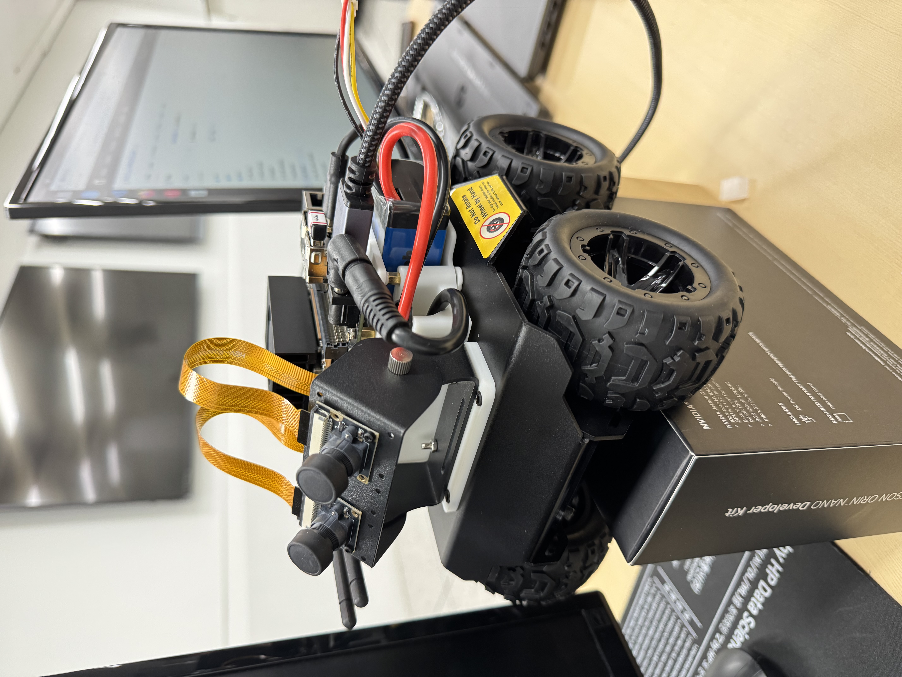

# Jetson-Orin Nano & Wave Rover Autonomous Driving

Autonomous driving system for the **Wave Rover** platform, built on **Jetson Orin Nano** with YOLO-based object detection and PID motor control. Developed as a class project for *Embedded Systems*.



[Mission demo video](./KakaoTalk_20260302_175208768.mp4)

## Table of Contents

- [Overview](#overview)
- [Midterm Project](#midterm-project)
  - [Task 1 — Traffic Light Recognition & Intersection Navigation](#task-1--traffic-light-recognition--intersection-navigation)
  - [Task 2 — Sign-based Speed & Stop Control](#task-2--sign-based-speed--stop-control)
  - [Task 3 — Object Detection & Avoidance Maneuver](#task-3--object-detection--avoidance-maneuver-core-task)
  - [Task 4 — Complex Scenario Integration](#task-4--complex-scenario-integration)
  - [Technical Insights](#technical-insights)
- [Final Project](#final-project)
  - [Feedback Loop: Solving Key Challenges](#1-solving-key-challenges-feedback-loop)
  - [Advanced Mission: Dynamic Obstacle Response](#2-advanced-mission-dynamic-obstacle-response)
- [Repository Structure](#repository-structure)
- [Documentation](#documentation)

## Overview

| | |
|---|---|
| **Platform** | Jetson Orin Nano + Wave Rover |
| **Perception** | YOLO-based object detection |
| **Control** | PID-based motor / steering control |
| **Goal** | Enable the rover to perceive its surroundings and execute autonomous driving missions (traffic lights, signage, obstacle avoidance) |

---

## Midterm Project

The midterm phase focused on enabling the rover to perceive its surroundings and execute specific driving missions.

### Task 1 — Traffic Light Recognition & Intersection Navigation

**Mission:** Detect red/green traffic lights at intersections and control the vehicle's movement accordingly.

**Strategy:** Real-time detection logic — the rover stops when a red light's bounding box exceeds a certain area (indicating proximity) and resumes driving once the signal changes.

https://github.com/user-attachments/assets/dd74f1a1-c7ce-4253-85a5-beb5a8b62da6

### Task 2 — Sign-based Speed & Stop Control

**Mission:** Respond to *Pedestrian* (slow down) and *Stop* signs on the roadside.

**Strategy:** PWM (Pulse Width Modulation) is pulsed to reduce motor output when a pedestrian sign is detected. For stop signs, a timer-based logic keeps the vehicle stationary for a set duration before proceeding.

https://github.com/user-attachments/assets/e7d3280b-2b9b-4d21-9ad9-5626f00b2f9c                   https://github.com/user-attachments/assets/b2ea1170-c732-42fd-b633-5b6813f8f7cc

### Task 3 — Object Detection & Avoidance Maneuver (Core Task)

**Mission:** Identify obstacles (cars, trucks, etc.) and perform an avoidance maneuver without collision.

**Strategy:** A 3-step avoidance algorithm:

1. **Avoiding** — steer away from the center lane upon detection
2. **Straight** — maintain a parallel path to bypass the obstacle
3. **Recovery** — return to the original lane and realign with the center line using PID control

### Task 4 — Complex Scenario Integration

**Mission:** Navigate intersections while simultaneously processing traffic lights and directional signs (left/right/straight).

**Strategy:** A decision-making hierarchy prioritizes signals — the red light signal always takes priority over directional signs to ensure safety and compliance.

### Technical Insights

- **Dataset:** Over 27,000 frames collected to ensure high detection accuracy across various lighting conditions.
- **PID tuning:** To resolve oscillation during lane-keeping, the integral gain (Ki) was fine-tuned from `0.1` → `0.095`, significantly improving driving stability.

For detailed technical documentation, including source code and experimental data, see the [Documentation](#documentation) section below.

---

## Final Project

The final phase focused on enhancing the vehicle's decision-making logic and stabilizing driving performance, based on feedback from the midterm evaluation.

### 1. Solving Key Challenges (Feedback Loop)

- **Stabilizing control:** Fine-tuned PID parameters to resolve lane-keeping oscillation, resulting in smoother, more reliable path-following.
- **Enhanced perception:** Expanded the dataset and refined the YOLO model for more consistent detection of vehicle types and traffic signals across lighting conditions.

### 2. Advanced Mission: Dynamic Obstacle Response

**"Wait or Overtake" logic:** Unlike the midterm project, which only handled static objects, the final system responds to moving vehicles.

**Decision making:** The rover waits for a set duration (e.g. 5 seconds) if a vehicle is detected ahead. If the obstacle remains stationary, the rover automatically initiates the 3-step avoidance maneuver (Avoiding → Straight → Recovery).

For detailed technical documentation, see the Final Presentation Slides in [Documentation](#documentation).

---

## Repository Structure

```
Embedded-System-/
├── Final_Project/Your_Own_Problem/     # Final project source & materials
├── Midterm Project/Task Project/       # Midterm project source & materials
├── KakaoTalk_20260302_175125699.jpg    # Wave Rover photo
├── KakaoTalk_20260302_175208768.mp4    # Mission demo video
└── README.md
```

## Documentation

| File | Description |
|---|---|
| [임베디드 프로젝트 중간보고서(2019048440 최윤석)(최종본).pdf](<./임베디드 프로젝트 중간보고서(2019048440 최윤석)(최종본).pdf>) | Midterm report |
| [임베디드 프로젝트 중간 발표자료(장경민, 김준성, 최윤석).pdf](<./임베디드 프로젝트 중간 발표자료(장경민, 김준성, 최윤석).pdf>) | Midterm presentation slides |
| [임베디드_최종(장경민, 김준성, 최윤석).pdf](<./임베디드_최종(장경민, 김준성, 최윤석).pdf>) | Final presentation slides |
